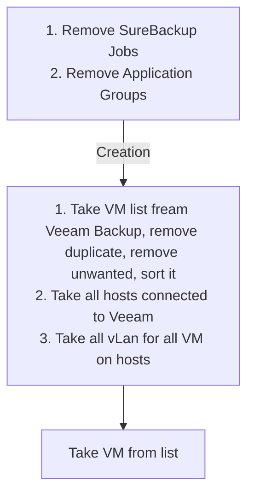

# PSVeeamTools

[](https://ci.appveyor.com/project/DomBros/PSVeeamTools/branch/master)

PSVeeamTools
=============

PowerShell module with basic Tools for Veeam B&R mgmt

This is a PowerShell module with a variety of functions usefull in a day-to-day tasks.

Pull requests and other contributions are more than welcome!

## Instructions

```powershell

# One time setup
    # Download the repository
    # Unblock the zip
    # Extract the PSVeeamTools folder to a module path (e.g. $env:USERPROFILE\Documents\WindowsPowerShell\Modules\)

    #Simple alternative, if you have PowerShell 5, or the PowerShellGet module:
        Install-Module PSVeeamTools

# Import the module.
    Import-Module PSVeeamTools #Alternatively, Import-Module \\Path\To\PSVeeamTools

# Get commands in the module
    Get-Command -Module PSVeeamTools

# Get help
    Get-Help about_PSVeeamTools
```

# Examples

## Example 1
```powershell
Remove-VTvLabAllDependVM -Verbose
Set-VTvLabAllDependency -Verbose

$Cred = Get-Credential -Message 'Credentials for Scheduled Tasks creation and running' -UserName "$env:USERDOMAIN\$env:USERNAME" Set-VTVbrSureBackupScheduledTask -Credential $Cred
```

## Schema
